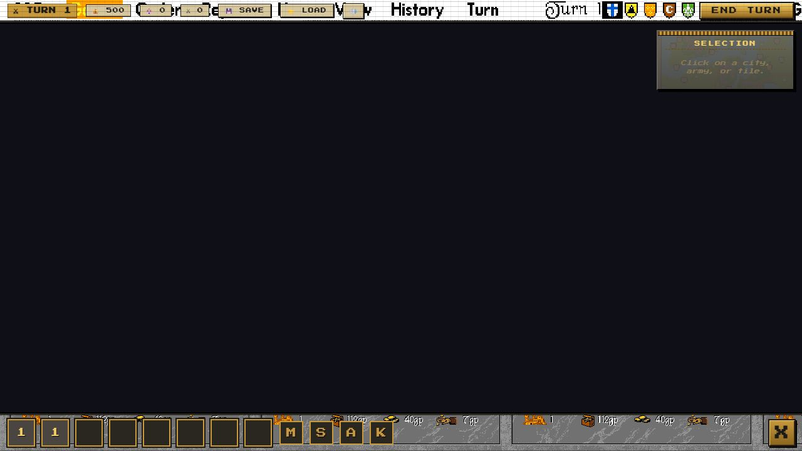

# Warlords II Clone

> A browser-based recreation of the 1993 SSI classic, rebuilt from the
> ground up with **Phaser 3**, **TypeScript**, and **Vite**.

[](./docs/releases/v1.0.md)
[](#roadmap)
[](#how-to-play)
[](./LICENSE)
[](https://www.typescriptlang.org/)
[](https://vitejs.dev/)
[](https://phaser.io/)





A turn-based strategy game with **eight factions**, stack-based tactical
combat, heroes with progression, city capture, AI opponents, save/load,
and 1993-styled VICTORY / DEFEAT scenes — faithful to the 1993
*Warlords II* in both playability and visual quality, but modernised
for the browser.

> **v1.0 is out.** See [`docs/releases/v1.0.md`](./docs/releases/v1.0.md)
> for the full release notes. All 17 planned phases (0-16) are
> complete: 110 / 110 unit tests pass, 66 / 66 e2e tests pass.

## Quick start

```bash
npm install
npm run dev
```

Open <http://localhost:5173>. The Vite dev server supports HMR — your
edits land instantly.

### Other scripts

```bash
npm test         # Vitest unit tests (110 cases)
npm run typecheck
npm run lint
npm run build    # produces dist/ for static deploy
npm run preview  # serve the built dist/ locally on :4173
npm run e2e      # Playwright smoke (66 cases; needs dev server)
```

## How to play

> The game is **fully playable** end-to-end. You can play a 4-faction
> or 8-faction match, recruit the Settler to found new cities, level
> up heroes, and reach a VICTORY or DEFEAT screen.

The flow:

1. Pick a faction — Humans, Elves, Orcs, Undead, Siroms, Dark Elves,
   Fey, or Syrnyn.
2. Explore the procedurally generated map.
3. Click your army → click a destination to move.
4. Right-click an enemy to attack.
5. Capture cities, recruit units (including the Settler), level up
   heroes.
6. Win by capturing 75 % of cities or eliminating all enemies.
7. Click the 1993-styled VICTORY / DEFEAT panel to return to the
   main menu.

Full rules: see [`SPEC.md`](./SPEC.md). In-game manual:
[wiki/Game-Manual](./docs/wiki/Game-Manual.md).

## Architecture

This project follows the **simulation / render split**: pure state
and rules live in `src/sim/`, Phaser scenes in `src/render/` read
that state and emit input actions, and the DOM HUD in `src/hud/`
sits on top of the canvas.

```
Player input → sim (state + rules) → snapshot → render (Phaser) + HUD (DOM)
```

See [`docs/architecture.md`](./docs/architecture.md) for the full
module diagram and state-ownership rules.

## Project structure

```
src/
├── main.ts          Vite entry; boots Phaser
├── config.ts        Tile size, palette, balance numbers
├── sim/             Pure simulation (no Phaser, no DOM)
│   ├── state.ts     GameState types + factory
│   ├── state.test.ts
│   ├── combat.ts    Stack-based combat resolution
│   ├── ai.ts        A* pathfinding + AI strategy
│   └── faction-bonus.ts
├── render/          Phaser scenes
│   ├── BootScene.ts
│   ├── MenuScene.ts        1993 title screen backdrop
│   ├── FactionScene.ts     8-faction select grid
│   ├── GameScene.ts        1993 world map + chrome
│   ├── CombatScene.ts      1993 combat screen
│   ├── ProductionScene.ts  1993 production dialog
│   ├── HeroScene.ts        1993 hero dialog
│   ├── QuestScene.ts       1993 quest dialog (4 variants)
│   ├── OutcomeScene.ts     1993 VICTORY/DEFEAT overlay
│   ├── palette.ts          16-color Warlords-II palette
│   ├── pixel-art.ts        hand-coded sprite renderer
│   ├── procedural-sprites.ts
│   └── index.ts
├── hud/             DOM HUD layer
│   ├── hud.css
│   ├── hud.ts
│   ├── store.ts
│   └── panels/
│       ├── top-bar.ts
│       ├── side-panel.ts
│       ├── action-bar.ts   1993 bottom action bar
│       └── message-box.ts
├── input/           Action names + keymap
├── data/            Static data (units, factions, heroes, terrain, manifests)
├── assets/          Phaser loader wrapper + audio manager
├── save/            JSON serialization + localStorage adapter
├── debug/           Dev menu + perf overlay (URL-flag-gated)
└── styles/          base.css

scripts/             One-off data and asset scripts (read-only outside public/)
tests/unit/          Vitest unit tests
tests/e2e/           Playwright e2e + screenshot tests
docs/                Architecture, visual fidelity, per-phase changelogs, releases
```

## Docs

* [`SPEC.md`](./SPEC.md) — full game design (units, factions, combat
  formula, AI).
* [`docs/architecture.md`](./docs/architecture.md) — module boundaries,
  state rules.
* [`docs/visual-fidelity.md`](./docs/visual-fidelity.md) — sprite,
  tile, UI, audio standards; documents the original-1993-as-backdrop
  approach.
* [`docs/original-reference.md`](./docs/original-reference.md) — the
  1993 source-game reference (palette, soundtrack, faction list).
* [`docs/asset-credits.md`](./docs/asset-credits.md) — generation
  pipeline and license notes.
* [`docs/wiki/Game-Manual.md`](./docs/wiki/Game-Manual.md) — in-game
  manual.
* [`docs/changelog/`](./docs/changelog/) — per-phase changelogs
  (phase-0.md through phase-16.md).
* [`docs/releases/`](./docs/releases/) — per-release notes
  (v1.0.md).
* [`docs/screenshots/`](./docs/screenshots/) — per-phase screenshots.
* [`CHANGELOG.md`](./CHANGELOG.md) — top-level, all-phase changelog.
* [`RELEASES.md`](./RELEASES.md) — tagged-release index.
* [`CONTRIBUTING.md`](./CONTRIBUTING.md) — how to file issues, run
  tests, open PRs.
* [`SECURITY.md`](./SECURITY.md) — security policy.
* [`CODE_OF_CONDUCT.md`](./CODE_OF_CONDUCT.md) — Contributor Covenant.

## Roadmap

| Phase | Goal | Status |
| --- | --- | --- |
| **0. Foundation** | Vite + TS + Phaser boots, HUD scaffold, scenes. | ✅ Done |
| **1. Map** | Procedural map gen, terrain rendering, camera. | ✅ Done |
| **2. Movement** | Player army, BFS movement, click-to-move. | ✅ Done |
| **3. Combat** | Stack model, combat resolution, hero bonuses. | ✅ Done |
| **4. Cities** | City capture, income, production, mines, ruins. | ✅ Done |
| **5. AI** | A* pathfinding, AI strategy. | ✅ Done |
| **6. Faction identity** | Faction bonuses, hero abilities, armories. | ✅ Done |
| **7. Win conditions** | 75 % capture or elimination. | ✅ Done |
| **8. Save / load** | JSON serialization, localStorage. | ✅ Done |
| **9. Assets** | Procedural sprite pipeline. | ✅ Done |
| **10. Polish** | Movement tween, tile flash, reduced-motion. | ✅ Done |
| **11. Playtest + deploy** | Build verified, deploy documented. | ✅ Done |
| **12. AI-generated art & audio** | 48 sprites, 7 music tracks, 10 SFX. | ✅ Done |
| **13. 16-color pixel art** | 49 hand-coded SVGA sprites, chiseled HUD. | ✅ Done |
| **14. Original 1993 backdrops** | Title / world / combat / hero / production / quest screenshots as in-game backdrops; byte-exact `STANDARD.PAL`. | ✅ Done |
| **15. 1993 HUD chrome + dialogs** | Top / right / bottom HUD crops; Production / Hero / Quest dialogs. | ✅ Done |
| **16. Settler + 4 new factions + outcomes** | Full 1993 roster of 8 factions, Settler, 1993 VICTORY / DEFEAT scenes. | ✅ Done |

**All 17 phases complete.** v1.0 is the first public release.
Per-phase detail at `docs/changelog/phase-N.md`. Per-release
notes at `docs/releases/vX.Y.Z.md`.

## Deployment

`npm run build` produces a static `dist/` directory. Drop it on any
static host:

| Host | One-liner |
| --- | --- |
| Vercel | `vercel deploy --prod` (after `npm i -g vercel`) |
| Netlify | `netlify deploy --prod --dir=dist` (after `npm i -g netlify-cli`) |
| Local preview | `npm run preview` (Vite serves `dist/` on port 4173) |

GitHub Pages is **not** enabled. The clone uses 1993 SSG assets
under fair use as fan-clone reconstruction reference; before
enabling Pages, confirm you're comfortable with the broader
public exposure that brings.

The app is fully client-side — no server, no database, no env vars
required. Saves live in `localStorage` per-browser.

## URL flags

`?scene=GameScene` — boot straight to the game (skips the menu).
`?scene=ProductionScene|HeroScene|QuestScene|OutcomeScene` — open a
specific dialog.
`?faction=humans|elves|orcs|undead|siroms|darkelves|fey|syrnyn` —
choose faction without the menu.
`?kind=won|lost` — outcome screen variant (with `?scene=OutcomeScene`).
`?motion=0` — disable movement tweens and tile flashes.
`?perf=1` — show FPS / draw-call overlay in the top-left.
`?dev=1` — enable the dev menu (`?` to open).
`?mute=1` / `?music=0` / `?sfx=0` — audio toggles.

## Contributing

Please read [`CONTRIBUTING.md`](./CONTRIBUTING.md) first. Bug
reports use the **Bug report** issue template, feature requests
use **Feature request**, and per-phase work uses **Phase report**.
All PRs go through the standard PR template, which requires the
local validation suite to be green.

## Repo stewardship

GitHub-side operations (releases, issue triage, PR review, label
set, milestones, Dependabot triage, wiki, Discussions) are owned
by the **`github-steward`** agent — the only agent that should
touch `mcp__github__*` for this project. See its
[`agent.md`](./.minimax/agents/github-steward/agent.md) (in the
local checkout of MiniMax Code's data dir) for the full scope and
hard constraints.

## License

ISC. See [`LICENSE`](./LICENSE) for the full text, including the
asset notice crediting the 1993 SSG / Steve Fawkner originals
under fair use.
