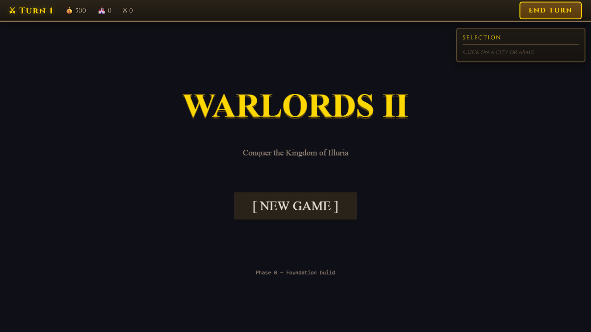
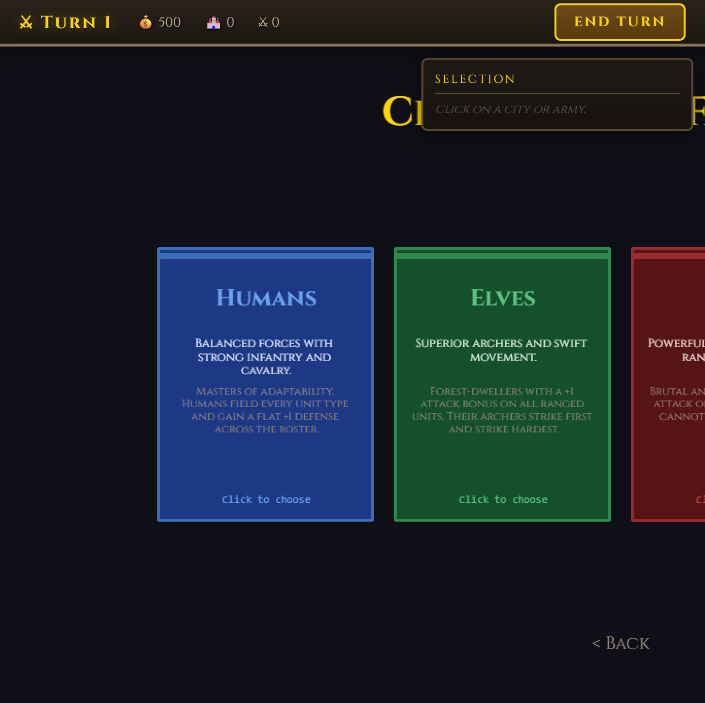

# Warlords II Clone

> A browser-based recreation of the 1993 SSI classic, rebuilt from the ground
> up with **Phaser 3**, **TypeScript**, and **Vite**.

[](#roadmap)
[](#roadmap)
[](#license)
[](https://www.typescriptlang.org/)
[](https://vitejs.dev/)
[](https://phaser.io/)





A turn-based strategy game with four factions, stack-based tactical combat,
heroes with progression, city capture, and AI opponents — faithful to the
1993 Warlords II in both playability and visual quality, but modernised for
the browser.

## Quick start

```bash
npm install
npm run dev
```

Open <http://localhost:5173>. The Vite dev server supports HMR — your edits
land instantly.

### Other scripts

```bash
npm test         # Vitest unit tests
npm run typecheck
npm run lint
npm run build    # produces dist/ for static deploy
npm run preview  # serve the built dist/ locally
npm run e2e      # Playwright smoke (requires dev server)
```

## How to play

> The game is a **Phase 0 foundation** build right now. You can navigate
> the main menu and faction select; the actual gameplay arrives in Phase 1.
> See [the roadmap](#roadmap) for what's coming.

The eventual flow:

1. Pick a faction (Humans, Elves, Orcs, or Undead).
2. Explore the procedurally generated map.
3. Click your army → click a destination to move.
4. Right-click an enemy to attack.
5. Capture cities, recruit units, level up heroes.
6. Win by capturing 75 % of cities or eliminating all enemies.

Full rules: see [`SPEC.md`](./SPEC.md).

## Architecture

This project follows the **simulation / render split**: pure state and
rules live in `src/sim/`, Phaser scenes in `src/render/` read that state and
emit input actions, and the DOM HUD in `src/hud/` sits on top of the canvas.

```
Player input → sim (state + rules) → snapshot → render (Phaser) + HUD (DOM)
```

See [`docs/architecture.md`](./docs/architecture.md) for the full module
diagram and state-ownership rules.

## Project structure

```
src/
├── main.ts          Vite entry; boots Phaser
├── config.ts        Tile size, palette, balance numbers
├── sim/             Pure simulation (no Phaser, no DOM)
│   ├── state.ts     GameState types + factory
│   └── state.test.ts
├── render/          Phaser scenes
│   ├── BootScene.ts
│   ├── MenuScene.ts
│   ├── FactionScene.ts
│   ├── GameScene.ts
│   ├── CombatScene.ts
│   └── index.ts
├── hud/             DOM HUD layer
│   ├── hud.css
│   ├── hud.ts
│   ├── store.ts
│   └── panels/
│       ├── top-bar.ts
│       ├── side-panel.ts
│       └── message-box.ts
├── input/           Action names + keymap
├── data/            Static data (units, factions, heroes, terrain, manifests)
├── assets/          Phaser loader wrapper
├── save/            JSON serialization + localStorage adapter
├── debug/           Dev menu + perf overlay (URL-flag-gated)
└── styles/          base.css
```

## Docs

* [`SPEC.md`](./SPEC.md) — full game design (units, factions, combat formula, AI).
* [`docs/architecture.md`](./docs/architecture.md) — module boundaries, state rules.
* [`docs/visual-fidelity.md`](./docs/visual-fidelity.md) — sprite, tile, UI, audio standards.
* [`docs/changelog/phase-0.md`](./docs/changelog/phase-0.md) — Phase 0 release notes.
* [`docs/dos-ui-reference.html`](./docs/dos-ui-reference.html) — archived DOS-themed UI mockup from the original prototype.
* [`docs/screenshots/`](./docs/screenshots/) — per-phase screenshots.

## Roadmap

| Phase | Goal | Status |
| --- | --- | --- |
| **0. Foundation** | Vite + TS + Phaser boots, HUD scaffold, scenes. | ✅ Done |
| **1. Map** | Procedural map gen, terrain rendering, camera. | ✅ Done |
| **2. Movement** | Player army, BFS movement, click-to-move. | ✅ Done |
| **3. Combat** | Stack model, combat resolution, hero bonuses. | Planned |
| **4. Cities** | City capture, income, production, mines, ruins. | Planned |
| **5. AI** | A* pathfinding, AI strategy. | Planned |
| **6. Faction identity** | Faction bonuses, hero abilities, armories. | Planned |
| **7. Win conditions** | 75 % capture or elimination. | Planned |
| **8. Save / load** | JSON serialization, localStorage. | Planned |
| **9. Assets** | Sprite-pipeline generation for all unit/terrain/city/hero art. | Planned |
| **10. Polish** | Sound, animation, tutorial, settings. | Planned |
| **11. Playtest + deploy** | Visual regression, perf, public deploy. | Planned |

MVP cutoff at end of Phase 7. Ship-quality cutoff at end of Phase 11.

## Scripts folder

`scripts/` contains PowerShell helpers used to repair the local PowerShell
host during early development. Keep them around in case the host breaks
again — they're idempotent and read-only against the file system outside
`C:\Program Files\PowerShell\7`.

## Contributing

Phase 0 is a foundation build; the contribution surface opens up as
features land. Until then, the most useful thing is to read
[`docs/architecture.md`](./docs/architecture.md) and
[`docs/visual-fidelity.md`](./docs/visual-fidelity.md) and push back on
anything that doesn't match your expectations before Phase 1 starts.

## License

ISC.
